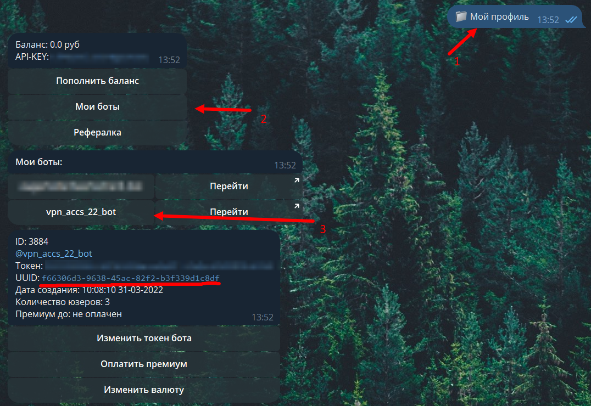
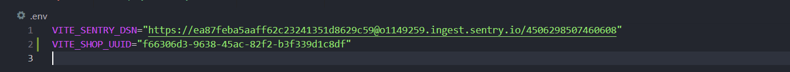
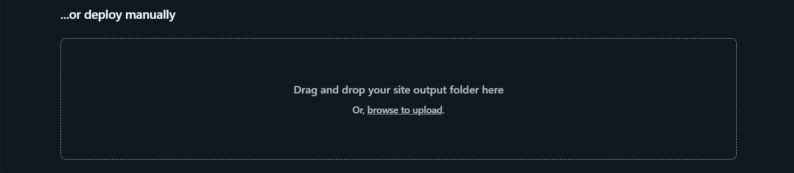

# Установка шеб-шопа на [netlify](netlify.com)

### Шаг 1

Переходим и регистрируемся на [netlify.com](netlify.com)

### Шаг 2

Скачиваем [актуальный код](https://github.com/alteralt/tippisell-web-shop/archive/refs/heads/main.zip) из основной ветки

### Шаг 3

Распаковываем архив, переходи к директории и устанавливаем зависимости

```sh
npm install
```

### Шаг 4

Переходим в @tippisell_bot и получаем uuid магазина

<details>
    <summary>📚 Скриншоты</summary>



</details>

### Шаг 5

Добавляем в .env файл uuid магазина. Должно стать как на скрине

<details>
    <summary>📚 Скриншоты</summary>



</details>

### Шаг 6

Билдим приложение командой

```sh
npm run build
```

### Шаг 7

Переходим на [netlify](https://app.netlify.com)
Кликаем сюда 
И выбираем папку dist, в которой находитися собранное приложение

### Шаг 8

Переходим во вкладку <i>Domain management</i> и оттуда подключаем свой домен

Теперь у нас есть веб-магазин на своём домене и совершенно бесплатно

#### Аналогичные netlify.com сервисы

-   [vercel](vercel.com)
-   [pages.github](pages.github.com)
-   [pages.cloudflare](pages.cloudflare.com)
